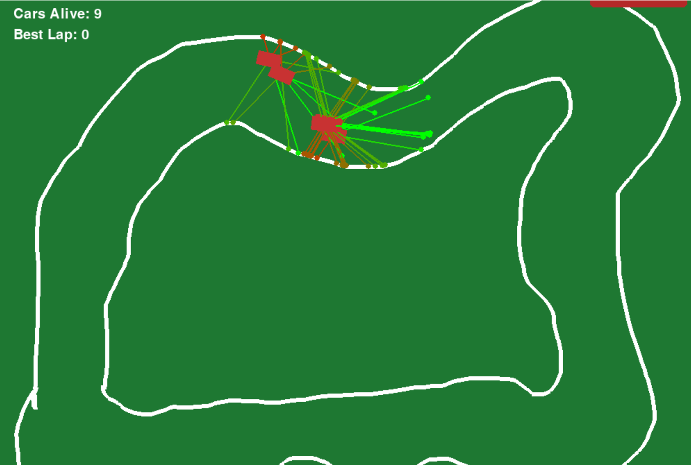
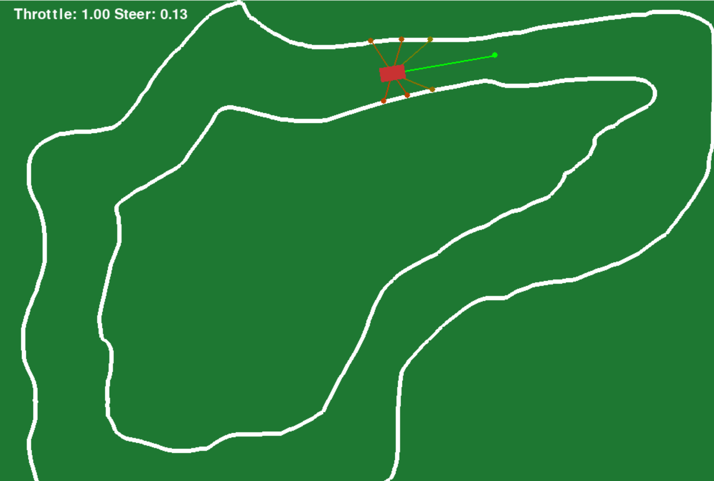
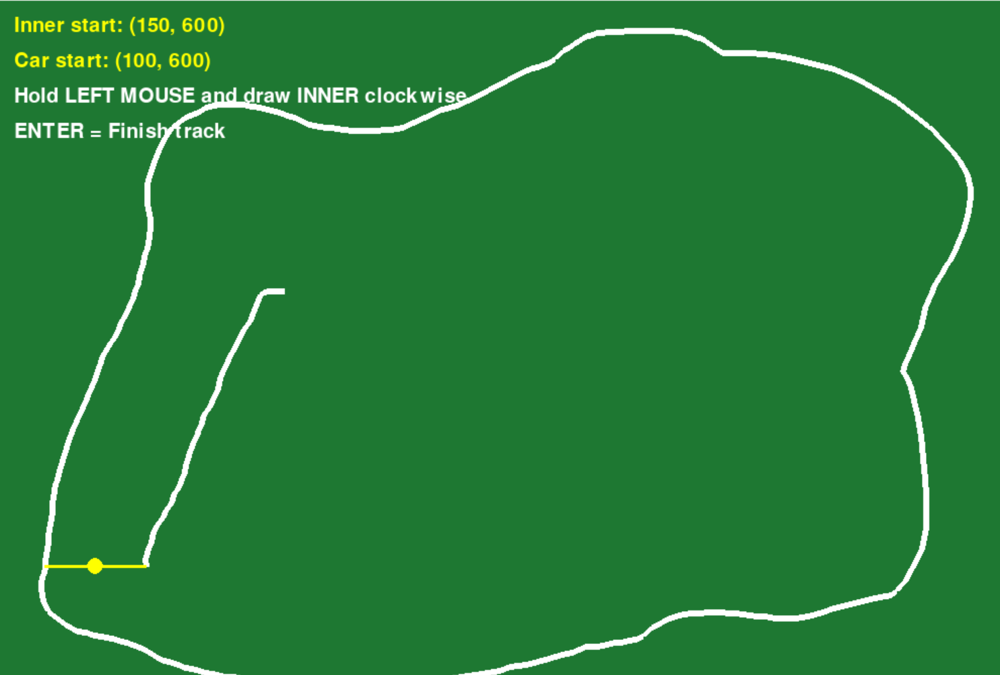
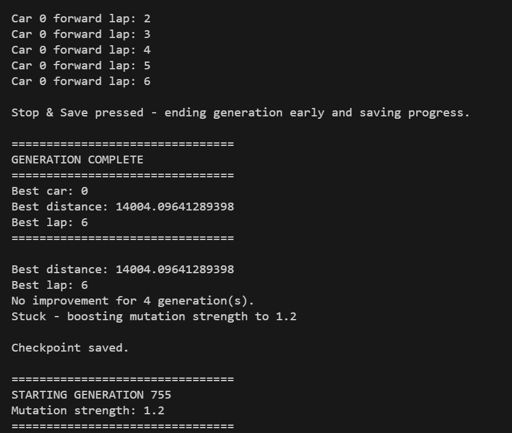
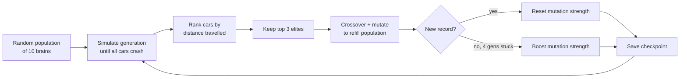

# 🚗 Neural Autonomous Driving Simulator

**Self-driving cars that teach themselves to race, powered by a neural network and genetic algorithm written from scratch in pure Python.**

A population of cars, each controlled by its own feed-forward neural network, learns to drive around a 2D track using only seven ray-cast distance sensors. There is no labelled data, no hand-written driving rules, and no ML framework (no PyTorch, TensorFlow, or NumPy). The drivers improve purely through **neuroevolution**: the best cars survive, breed, and mutate, generation after generation.

<p align="center">
  
</p>

<!-- 📸 SCREENSHOT: Put a short screen recording (5–15 s) of training at docs/screenshots/demo.gif.
     Tip: record with ShareX / ScreenToGif (Windows) or Kap (macOS), then keep it under ~10 MB. -->

---

## 📌 Highlights

- **Neural network from first principles**: layers, weights, biases, `tanh` activation and forward propagation, all in plain Python.
- **Genetic algorithm** with elitism, uniform crossover, Gaussian mutation, and **adaptive mutation strength** that ramps up automatically when training plateaus.
- **Ray-casting sensor system** that uses exact ray/line-segment intersection math to measure distance to the track walls.
- **Lap-aware fitness function** that tracks progress along the track, counts forward laps, penalises driving backwards across the finish line, and never lets fitness decrease mid-run.
- **Fault-tolerant checkpointing**: training state is saved every generation and resumes exactly where it left off. It validates the network architecture and gracefully handles corrupted or older checkpoint files.
- **Built-in track editor** to draw, name, and save custom tracks with the mouse.
- **Result**: the included checkpoint was trained for **750+ generations** and its best car drives **~27 consecutive laps** without crashing.

---

## 🖼️ Screenshots

| Training (population of 10 cars) | Trained car driving solo |
|:---:|:---:|
|  |  |
| *`python train.py`: all cars with sensor rays, live stats, Stop & Save button* | *`python main.py`: best brain driving, live throttle/steer output* |

| Track editor | Console training log |
|:---:|:---:|
|  |  |
| *`python track.py`: drawing a custom track* | *Generation summaries, records, and mutation boosts* |

<!-- 📸 SCREENSHOTS: Save your images into docs/screenshots/ using exactly these file names:
     demo.gif, training.png, trained-run.png, track-editor.png, console.png -->

---

## 🧠 How It Works



### 1. Perception: ray-cast sensors
Each car carries **7 distance sensors** fanned out at `0°, ±30°, ±60°, ±110°` relative to its heading, each 150 px long. Every frame, each sensor casts a ray and computes its exact intersection with every segment of the inner and outer track walls (using a 2D cross-product line-intersection test), keeping the nearest hit. The distance is normalised to `0.0` (touching a wall) through `1.0` (nothing within range). The rays are drawn on screen with a green→red gradient as walls get closer.

### 2. Decision-making: neural network
The 7 sensor readings are the network's **only input**. The network has the architecture `[7, 8, 2]`:

| Layer | Size | Activation |
|---|---|---|
| Input | 7 sensor distances | — |
| Hidden | 8 neurons | `tanh` |
| Output | 2 neurons: **throttle**, **steering** | `tanh` → range `[-1, 1]` |

### 3. Physics: car model
Throttle accelerates or brakes/reverses the car (top speed 4 px/frame forward, half that in reverse), and friction slows it when coasting. Steering is **scaled by current speed**, so a stationary car cannot spin on the spot. This forces the network to learn to move forward in order to turn.

### 4. Fitness: distance along the track
Progress is measured by finding the car's nearest point on the track boundary. The search is limited to a window around its last known position so it can't "teleport" across the map. Crossing the start/finish line forwards adds a lap, and crossing it backwards subtracts one, with lock flags to prevent double counting. Fitness is:

```
fitness = laps × track_length + distance_into_current_lap
```

and a car's recorded fitness **never decreases**, so only real forward progress is rewarded. A car crashes when any sensor reads below `0.1` (i.e. it gets within ~15 px of a wall).

### 5. Evolution: genetic algorithm
When every car has crashed (or you press **Stop & Save**):
1. The population is ranked by fitness.
2. The **top 3 elites** are copied unchanged into the next generation.
3. The remaining slots are filled by **uniform crossover** of two random elites (each weight and bias is taken from either parent with 50/50 odds), followed by **Gaussian mutation** (each parameter has a 10 % chance of being nudged).
4. **Adaptive mutation:** if the best distance fails to beat the record for 4 generations in a row, mutation strength is multiplied by 1.5 (capped at 1.2) to help escape local optima. It resets to the base value as soon as a new record is set.

### 6. Persistence: checkpointing
After every generation, `training_checkpoint.json` stores the generation number, network architecture, all elite brains, the best distance record, the stagnation counter, and the current mutation strength. On start-up, `train.py` validates the checkpoint and resumes seamlessly. If the file is missing, corrupted, or built for a different architecture, it falls back to a fresh random population.

---

## 🚀 Getting Started

### Prerequisites
- **Python 3.8+** (developed on Python 3.10)
- **pygame 2.x**

### Installation

```bash
# 1. Clone the repository
git clone https://github.com/devansh173/neural-autonomous-driving-simulator.git
cd neural-autonomous-driving-simulator

# 2. (Optional) create and activate a virtual environment
python -m venv venv
venv\Scripts\activate          # Windows
source venv/bin/activate       # macOS / Linux

# 3. Install dependencies
pip install -r requirements.txt
```

### ▶️ Watch the pre-trained car drive

A trained checkpoint is already included, so you can see the result immediately:

```bash
python main.py
```

This loads the best brain from `training_checkpoint.json` and lets it drive on its own. The HUD shows whether the car is alive and the network's live throttle/steering output.

> By default `main.py` runs on the **`log`** track, which is different from the track the model was trained on. To watch it on its training track, set `TRACK_NAME = "three"` at the top of `main.py`.

### 🏋️ Train the model

```bash
python train.py
```

| Action | Effect |
|---|---|
| Training runs continuously | A new generation starts automatically when every car has crashed |
| Click **Stop & Save** (top-right) | Ends the current generation early, ranks the cars, and **saves** progress. Use this when a car is so good it never crashes! |
| Close the window (❌) | Stops training **without** saving the in-progress generation (the last completed one is kept) |
| Re-run `python train.py` | Automatically **resumes** from `training_checkpoint.json` |

> 💡 **Start training from scratch:** delete (or rename) `training_checkpoint.json` before running `train.py`.

### ✏️ Create your own track

```bash
python track.py
```

1. Hold the **left mouse button** and draw the **outer** wall clockwise, starting from the yellow start marker. Press **Enter**.
2. Draw the **inner** wall clockwise the same way. Press **Enter**.
3. Press **N**, type a name, and press **Enter**.
4. Press **S** to save to `tracks/<name>.json` (press **R** at any time to reset).

Then set `TRACK_NAME = "<name>"` in `simulation.py` (for training) and/or `main.py` (for playback).

<!-- 📸 SCREENSHOT (optional): add a before/after of a custom track you drew. -->

---

## ⚙️ Configuration

Hyperparameters are constants at the top of **`train.py`**:

| Setting | Description | Default |
|---|---|---|
| `POPULATION_SIZE` | Cars per generation | `10` |
| `ARCHITECTURE` | Network layer sizes | `[7, 8, 2]` |
| `ELITE_COUNT` | Top performers carried over unchanged | `3` |
| `MUTATION_RATE` | Chance each weight/bias is mutated | `0.10` |
| `BASE_MUTATION_STRENGTH` | Std-dev of Gaussian mutation noise | `0.30` |
| `MAX_MUTATION_STRENGTH` | Ceiling for adaptive mutation | `1.20` |
| `MUTATION_BOOST_FACTOR` | Multiplier applied when training stagnates | `1.50` |
| `STAGNATION_LIMIT` | Generations without a record before boosting | `4` |
| `IMPROVEMENT_THRESHOLD` | Minimum gain (px) that counts as a new record | `1.0` |

Other settings:
- **`simulation.py`**: `TRACK_NAME` (training track), `SEARCH_BACK` / `SEARCH_FORWARD` (progress-tracking window)
- **`car.py`**: `max_speed`, `acceleration`, `friction`, `max_steering`
- **`main.py`**: `TRACK_NAME` (playback track)

> ⚠️ Changing `ARCHITECTURE` makes the existing checkpoint incompatible. Training will detect this and start a fresh population.

---

## 📁 Project Structure

```
neural-autonomous-driving-simulator/
├── main.py                    # Playback: loads the best trained brain and drives autonomously
├── train.py                   # Genetic algorithm: selection, crossover, adaptive mutation, checkpoints
├── simulation.py              # Runs one generation: physics loop, fitness & lap tracking, rendering, Stop & Save
├── neural_network.py          # From-scratch neural network (Layer, Neural_Network: forward, copy, mutate, crossover)
├── car.py                     # Car physics: throttle, braking, friction, speed-scaled steering
├── sensor.py                  # Ray-cast distance sensor with ray/segment intersection
├── track.py                   # Interactive track editor (draw, name, save tracks)
├── neuron_test.py             # Early scratch test of a single tanh neuron layer
├── tracks/                    # Track definitions (outer/inner wall point lists, JSON)
│   ├── three.json             #   default training track
│   ├── log.json               #   default playback track
│   └── easy / hard / tough / five / first.json
├── training_checkpoint.json   # Saved training state (generation 753, included)
├── best_brain.json            # Legacy standalone brain export from an earlier version
├── requirements.txt
└── docs/screenshots/          # Images used in this README
```

---

## 🛠️ Tech Stack

| | |
|---|---|
| **Language** | Python 3 |
| **Rendering & input** | pygame |
| **Machine learning** | Custom neural network + genetic algorithm (no ML libraries) |
| **Persistence** | JSON |

---

## 🗺️ Future Improvements

- [ ] Headless training mode (no rendering) for much faster generations
- [ ] Train across multiple tracks at once to improve generalisation
- [ ] Per-generation timeout so a perfect driver ends the generation automatically
- [ ] Read spawn position/angle from each track's `start` field instead of a fixed point
- [ ] Plot fitness over generations (matplotlib) to visualise learning progress
- [ ] Visualise the network's neurons and weights live during playback

---

## 👤 Author

**Devansh** · [GitHub @devansh173](https://github.com/devansh173)

*Built to understand neural networks and evolutionary algorithms from the ground up by implementing every piece myself, without relying on machine-learning frameworks.*
